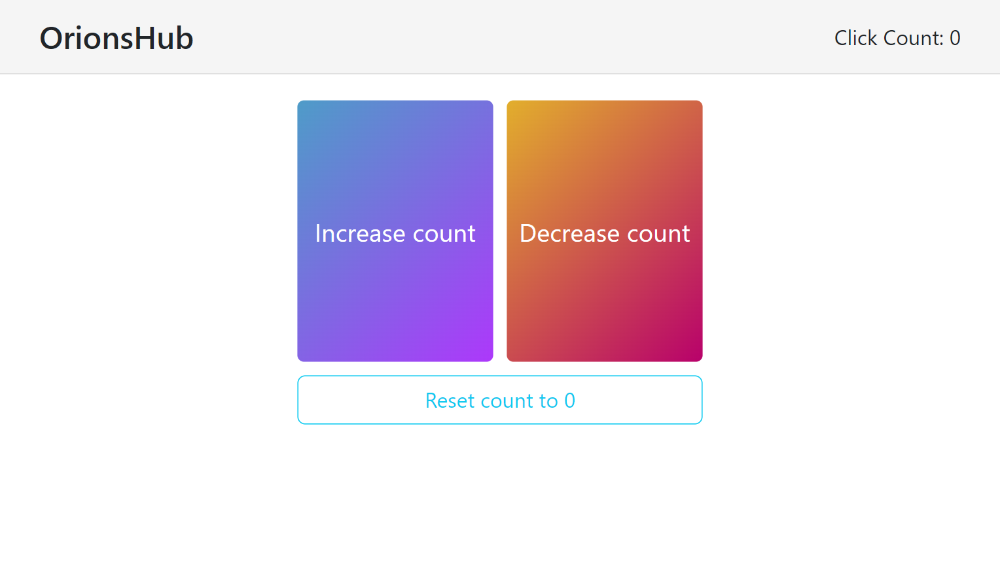
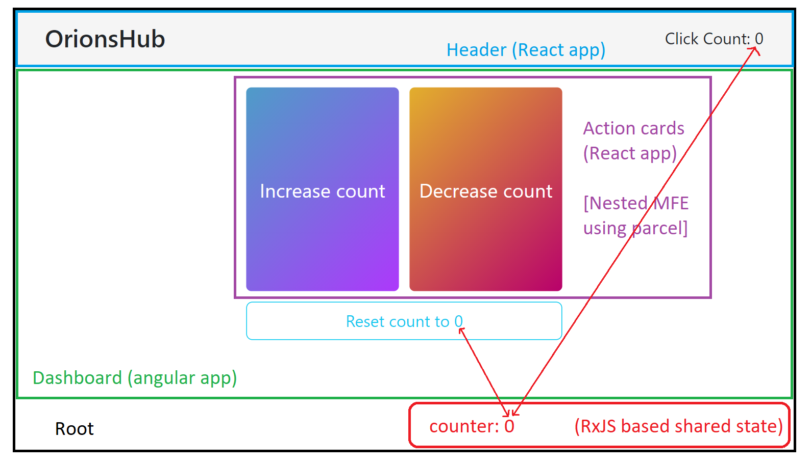

# single spa mfe layout

This repo has 5 applications:

- root (single spa root)
- header-react
- dashboard-angular
- increment-decrement-react (dashboard actions)
- shared-state-rxjs (utility module)

## output

## frontend architecture

## Combined README from these folder is here:

### 1. Root

Single spa root config project where we define layout and load the other application

#### a. Feature

- loads angular and react app both
- loads assets from node_modules dynamically to provide these to other micro-frontends using `copy-webpack-plugin`
  - it may cause CSP issue (in localhost) to avoid that either
    - run the server on https
    - modify the `<meta http-equiv="Content-Security-Policy" content="..." />` as per the requirement in the `index.ejs` file
      - `style-src` needs to be changed from `style-src 'unsafe-inline' https:;` to `style-src 'self' 'unsafe-inline';`

#### b. Routing

It is using `<single-spa-router>` (single spa template engine) but there are other approach as well to load the applications like hash routing

### 2. Header

Header is created using react and bootstrapped using `create-single-spa`.

It uses shared-state to display the real time counting which is being updated from other application

### 3. Dashboard

Consist increment-decrement-react app (dashboard-actions) as a nest MFE using parcel and shows that an MFE can reside in an another MFE

#### a. Important

- to consume the shared state, we need to push this to `singleSpaWebpackConfig.externals` array in `extra-webpack.config.js`
- shared state needs two things after pushed to externals
  - type file `./src/shared-state.d.ts`
  - path so that compiler knows where to find it's type
    - check `tsconfig.app.json`

### 4. Dashboard Actions (Inc / Dec)

Two actions cards consuming `shared-state` to update the counter and is loaded in the Dashboard application using parcels as a nested MFE

### 5. Shared State

Shared state is an in-browser module or utility-module which is based on RxJS to provide a communication layer in between all the micro front-end applications
